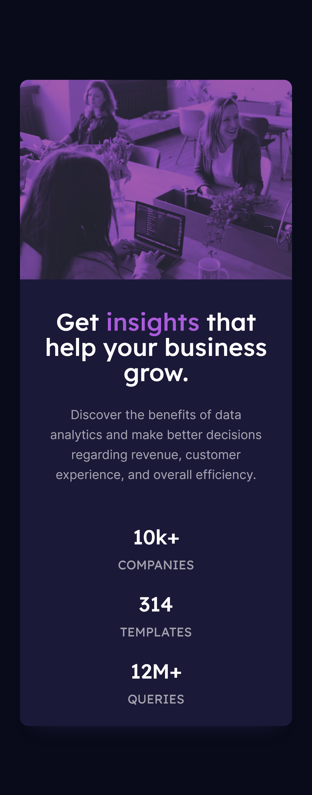

# Stats preview card component solution

This is a solution to the [Stats preview card component challenge on Frontend Mentor](https://www.frontendmentor.io/challenges/stats-preview-card-component-8JqbgoU62). Frontend Mentor challenges help you improve your coding skills by building realistic projects.

## Table of contents

- [Overview](#overview)
  - [The challenge](#the-challenge)
  - [Screenshot](#screenshot)
  - [Links](#links)
- [My process](#my-process)
  - [Built with](#built-with)
  - [What I learned](#what-i-learned)
  - [Useful resources](#useful-resources)
- [Author](#author)

## Overview

### The challenge

Users should be able to:

- View the optimal layout depending on their device's screen size

### Screenshot




### Links

- Solution URL: [Stats preview card component solution - GitHub](https://github.com/sunil-sharma-999/Stats-preview-card-component-solution)
- Live Site URL: [Stats preview card component](https://sunil-sharma-999.github.io/Stats-preview-card-component-solution)

## My process

### Built with

- HTML
- CSS
- CSS Grid
- Mobile-first workflo

### What I learned

Background Blend mode and filter

code:

```css
.img {
  background-blend-mode: multiply;
  filter: opacity(60%) contrast(75%) brightness(130%) saturate(150%);
  background-color: hsl(277, 93%, 71%);
  background-image: url(./images/image-header-mobile.jpg);
}
```

### Useful resources

- [CSS-Tricks](https://css-tricks.com/)
- [Stackoverflow](https://stackoverflow.com/)

## Author

- GitHub - [Sunil Sharma](https://github.com/sunil-sharma-999/)
- Frontend Mentor - [@sunil-sharma-999](https://www.frontendmentor.io/profile/sunil-sharma-999)
- Instagram - [@sunil-sharma-9](https://www.instagram.com/sunil.sharma.9)
